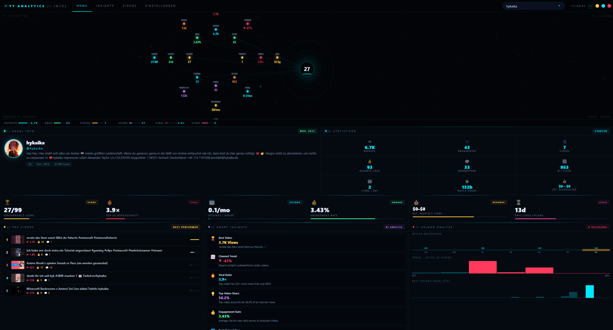

<div align="center">

# YT Analytics
### Channel Intelligence — by hykaika

*A desktop app that lets you deeply analyze any YouTube channel in seconds.*



</div>

---

## What is this?

**YT Analytics** is a Windows desktop app. You type in any YouTube channel name or handle, and it pulls all the data from the YouTube API and shows you a full breakdown — views, subscribers, likes, comments, revenue estimates, upload patterns, best performing videos, and much more.

It's built with a space / sci-fi HUD aesthetic with a live constellation graph that visualizes all your channel data across 20 nodes in real time.

---

## What you can see

### Channel Overview & Statistics

At the top you get the full channel profile plus a **9-stat grid**:

| Stat | Description |
|---|---|
| Total Views | All-time view count |
| Subscribers | Current subscriber count |
| Videos | Total published videos |
| Total Likes | Sum of likes across all analyzed videos |
| Comments | Sum of comments across all analyzed videos |
| Avg / Video | Average views per video |
| Views / Day | Lifetime daily average |
| Watch Hours | Estimated total hours watched |
| Est. Revenue/Month | Monthly earnings estimate (CPM-based) |

### 6 Performance Cards

Right below the stats, 6 live metric cards:

- **Performance Score** — custom 0–99 score
- **Viral Ratio** — how much the top video beats the average
- **Uploads / Month** — upload frequency
- **Engagement Rate** — average like-to-view ratio
- **Est. Monthly Revenue** — $low–$high range
- **Days Since Upload** — how long since the last video

### Smart Insights — 10 automated analyses


The app automatically analyzes the channel and generates 10 insights:

1. 🏆 Best performing video (title + view count)
2. 📈 Channel trend — is the channel growing or declining?
3. 🔥 Viral ratio — how extreme is the top video vs. average?
4. 💡 Top video's share of total channel views
5. 👍 Engagement rate across all videos
6. 📅 Best day of the week to upload
7. 💰 Monthly revenue estimate with CPM range
8. 📐 Best video length — which duration performs best
9. ⏰ Best upload hour (UTC) — 24-hour chart included
10. 📊 Views per day across the channel's lifetime

### Upload Analysis

- Bar chart showing average views per weekday (Mon–Sun)
- Trend chart of the last 20 videos (color coded: green = growing, red = declining)
- 24-hour upload time chart (which hour gets the most views)
- Monthly upload frequency (last 12 months)

### Video DNA

Breaks down every analyzed video by duration:

| Bracket | Range |
|---|---|
| Shorts | Under 1 minute |
| Short-form | 1–5 minutes |
| Medium | 5–20 minutes |
| Long-form | 20+ minutes |

Shows percentage, count, average views per bracket, average duration, total estimated watch hours, and marks the best performing length as the Sweet Spot.

### Performance Distribution

Shows what percentage of videos are Viral (3× avg), Good (1–3× avg), Average, or Below average.

### Channel Vitals & Upload Gaps

- Channel age (years)
- Views per day
- Views per subscriber
- Days since last upload
- Average gap between uploads
- Longest hiatus ever
- Shortest gap between uploads
- Upload frequency per month

### Most Liked, Most Commented, Top by Views/Day

Three ranked lists showing which videos get the most likes, most comments, and which are growing fastest relative to how long they've been live.

### All Videos


Every video shown as a card with:

- Thumbnail
- Duration overlay on the thumbnail
- Title
- Time since upload
- Views, 👍 Likes, 💬 Comments
- Performance % compared to channel average
- **🔥 VIRAL**, **🏆 TOP**, or **LOW** badge automatically applied

Click any video card to open it directly on YouTube.

### Constellation Graph

The top section shows a live space HUD with **20 data nodes** arranged across 3 orbital rings. Each node represents a different metric (views, subs, score, revenue, watch hours, etc.). They're all connected with cross-ring lines and **animated data pulses** that flow between nodes in real time.

---

## How to get started

### Step 1 — Get a free YouTube API Key

You need one before you can search anything. It's free and takes about 2 minutes.

1. Go to [console.cloud.google.com](https://console.cloud.google.com) and sign in with your Google account
2. Click **APIs & Services → Library**
3. Search for **YouTube Data API v3** → click **Enable**
4. Go to **APIs & Services → Credentials → Create Credentials → API Key**
5. Copy the key — it starts with `AIza…`

> The free daily quota is 10,000 units. A full channel analysis uses roughly 50–100 units, so you can analyze hundreds of channels per day.

### Step 2 — Paste the key into Settings

Open the app → click **Settings** in the top navigation → paste your key → click **Save Key**.

The key is stored locally on your PC only. It is never sent anywhere other than Google's own YouTube API.

### Step 3 — Search any channel

Type a channel handle like `@mkbhd` or a channel name into the search bar and press **Enter**. The app loads everything automatically in a few seconds.

---

## Other features

**Language** — Settings → switch between English and Deutsch at any time

**Fullscreen** — press `F11` or click the fullscreen button (top right). Press `F11` again or `Escape` to exit

**Desktop shortcut** — Settings → **Create Desktop Shortcut** button. Creates a `.lnk` on your Desktop (especially useful if you're using the portable version)

**Open videos** — click any video card, row, or thumbnail in the app to open that video on YouTube in your browser

---

## Installation

### Portable — no install needed
Download `YT Analytics 1.0.0.exe` from Releases, double-click, done. Nothing gets installed. You can run it from any folder or USB drive.

### Installer — recommended
Download `YT Analytics Setup 1.0.0.exe`, run it, and it creates Desktop + Start Menu shortcuts automatically.

### Run from source
```bash
git clone https://github.com/hykaika/yt-analytics.git
cd yt-analytics
npm install
npm start
```

Requires [Node.js](https://nodejs.org) v18+.

---

<div align="center">

© 2026 hykaika · All rights reserved · [github.com/hykaika](https://github.com/hykaika)

</div>
